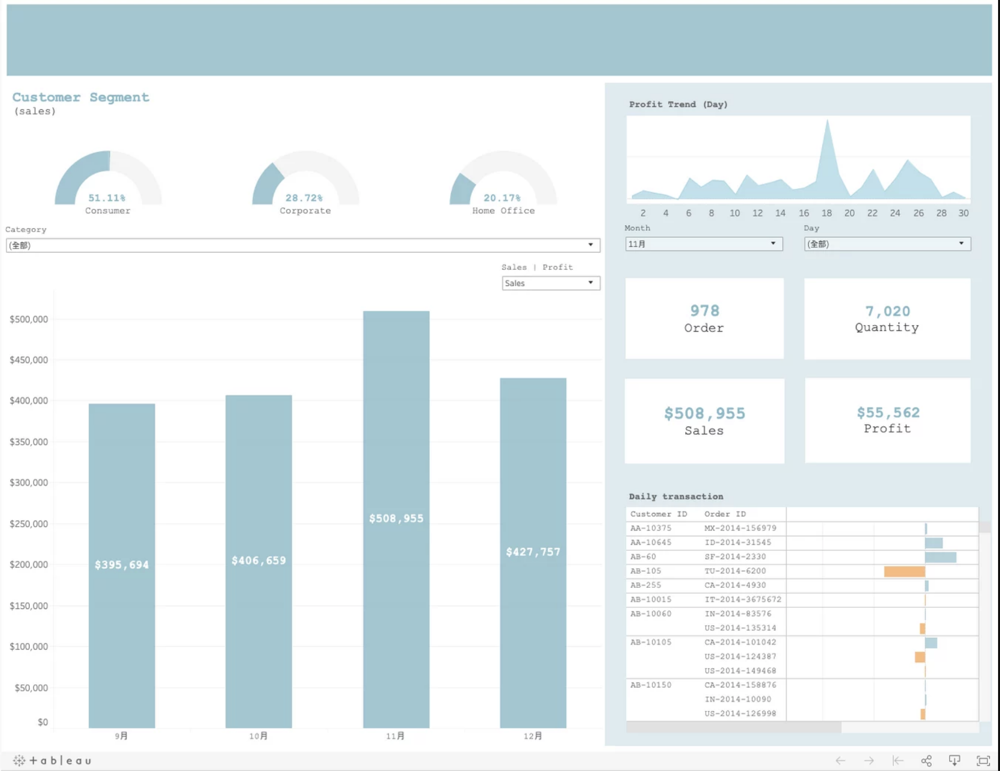

# Dataviz with Tableau II

## Introduction
In this project, I used transaction data of a superstore to create a dashboard that allows user to not only get a big picture of the sales shortly but also identify the trends and valuable customers. For demonstration purpose, I extracted only 4-month transaction data, containing 7,161 entries, from September to December 2014.

## Design and interaction
- **Gauge Chart on the upper left**\
This chart helps users to know who is their customers and what the formation of customer base is.

- **Bar chart on the bottom left**\
This chart holds up the largest space in the dashboard because it serves the purpose of delivering the overview of the sales and profit to users. Here, I decide to compare profits and sales across months so as to let the user know how the store is performing. Then, if any problem or any thing deserving attention occurs, users then move on to the right-hand side of the dashboard for detailed insights. The bar chart together with the gauge chart above allows users to view the metrics across various categories and the bar chart also provides the option to switch between sales and profit.

- **The combination chart on the right**\
This part of dashboard is designed to offer a detailed look of the purchase pattern and transaction information. Users are able to view the information such as the four most important metrics on a daily basis across different months. Additionally, when hovering over the order and sales blocks, users would find a more detailed information such as the breakdown of the metric. For instance, if you hover over the order block, you can expect to see the formation of the orders based on their importance. (Figure 1)
 

### Note
Please click the link at the bottom of the page, which brings you to Tableau Public, and interact with the Dashboard.

Data source: Kaggle

[Link to Dashboard](https://public.tableau.com/profile/yu.hsiang.hung#!/vizhome/SalesDashboardDesignWebsite/Final)
